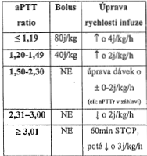
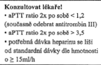
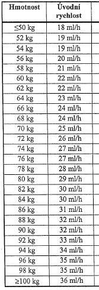

# Calculation approach

## Heparin

The function that calculates heparin recommendation (`calculateHeparinRecommendation`) for patients is based on this
table:

.

Doctor's notifications are based on this logic:



Initial dosage is based on the following data and uses fixed constant `DEFAULT_UNITS_PER_KG = 18`:



Heparin is not applied in its pure form, but in a solution. The actual heparin concentration is calculated using
parameters `solutionMilliliters` and `solutionHeparinUnits` stored in the database. The recommended dosage is always
in `milliliters` or `milliliters per hour`. The first check is scheduled 4 hours after the initial dosage,
then checks repeat in 6 hour intervals. One exception occurs if the aPTT value gets over 3. The continuous dosage is
then stopped for one hour and resumed afterwards.

## Insulin

The function that calculates insulin bolus for patient takes as parameters:

- expected carbohydrate intake (expected_carbohydrate_intake)
- target glycemia (target_glycemia)
- current glycemia (current_glycemia)
- total daily dosage of insulin (tddi)
- rapid insulin type (Humalog, Novorapid, Apidra, Fiasp, Lyumjev)
- list of boluses in the last 6 hours (with time and insulin amount)

```
    CARBS_RATIO_NUMERATOR = 350
    INSULIN_SENSIBILITY_NUMERATOR = 110
    dosage_carbohydrate_intake = expected_carbohydrate_intake / (CARBS_RATIO_NUMERATOR / tddi)
    dosage_target_glycemia = (current_glycemia - target_glycemia) / (INSULIN_SENSIBILITY_NUMERATOR / tddi)
    remaining_rapid_insulin = see below
    insulin_dosage = max(dosage_carbohydrate_intake + dosage_target_glycemia - remaining_rapid_insulin, 0)
```

- TDDI is provided by the doctor on the first day of patients arrival and then it is calculated for each day as the
  amount of insulin intake from the previous day.
- Current glycemia should be measured before every insulin application.
- Target glycemia is provided by the doctor.
- Amount of remaining_rapid_insulin is calculated from the properties of given rapid insulin type that we take from:
  https://www.ikem.cz/UserFiles/Image/1604920379L%C3%A9%C4%8Dba_inzulinem_u_diabetu_1._typu.pdf. The remaining rapid
  insulin level is calculated based on the graphs in the pdf and time from the previous bolus(es). We assume that if we
  have no data that current rapid insulin level is 0.