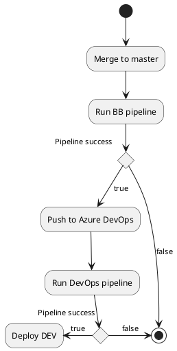

# Development

This document contains some basic information about project (BSS) infrastructure, best practises and *must have* project parts. 

## MildBlue Infrastructure

### Project Repository

Source code is hosted in [MildBlue GitHub](https://github.com/mild-blue/breviary).
Access can be given by some project administrator, but better is to ask [Eliska](eliska.grendelova@mild.blue)
to add you into project group `breviary`.

#### Code Review

For code review of this project we are using [MildBlue GitHub](https://github.com/mild-blue/breviary).

#### Bitbucket Pipelines

For automatic tests, we are using Bitbucket Pipelines. Definition file is */bitbucket-pipelines.yml*.
All used Docker images are stored in [Docker Hub](https://vault.bitwarden.com/).

#### DevOps and Pipelines

For automatic tests, we are using GitHub Actions. Definition files are `.github`.
Ask [Lukas](lukas.forst@mild.blue) or [Marek](marek.polak@mild.blue) to add you into the project.

### Task Management

Task management is provided via  [MildBlue Trello](https://trello.com).
Access can be given by some project administrator, but better is to ask anybody
to add you into project group `breviary`.

### Repository Management

For storing Docker images and Java modules we are using [Docker Hub](https://hub.docker.com).
Ask [Marek](marek.polak@mild.blue) or [Lukas](lukas.forst@mild.blue) to create an account for you.
Definition of all Docker images stored in Nexus must be stored in */docker_images* directory.

### Password Management

For storing password and certificates we are using [Bitwarden](https://vault.bitwarden.com).
Ask [Lukas](lukas.forst@mild.blue) to create an account for you.

#### Application Logs

TODO LINKS

### Development Environments

There exist multiple environments for development/test purposes:

#### Dev

This environment is used for development. It is automatically redeployed with every successful push and pipeline run into `master` branch.

TODO LINKS

#### Test

This environment is used for presentations. It must be redeployed manually.

TODO LINKS


## Best Practices

### Git

1. Branch name **should** start with task prefix, e.g., "`BREW-123`-add-teams-functionality".
1. Commit message **must** start with task prefix, e.g., "`BREW-123` New DB model added.".
1. Use full sentences for commit description in a form *Update of SOMETHING because of THIS.*.
Try to describe it to be intelligible for others.
1. When doing code review, beware of single words such as *no, why, ?*. It is useless.
Rather, write full sentences: *I think it should be done THIS way because of THIS.*. 
   *Please, do it this way because of THIS.*, etc. 
1. Try to make git tree well arranged, i.e., beware of many merging, etc.

### Source Code

We use many tools to achieve a good code, such as *code review*, *tests*, *code analysis*, *code linting*, *automation*.

1. If there is something important/not cleared, make a comment.
1. If it is too complex, write it into *GitBook*.
1. Write tests for everything if possible.
1. Automate everything if possible. 
    1. For common tasks such as build run, use *Makefile* tasks.
    1. For more complex tasks create a script and put it into *scripts* directory.
    

## Project Setup

To be able to develop and run project locally, some prerequisites must be satisfied:

* OpenJDK 11
* Docker
* Docker Compose

### backend/src/main/resources/application.properties file

To be able to run `beckend` application, you need to have set all required properties.
You can create `application.propeties` file or use `.env.template` file.

* Copy `.env.template` to `.env` file.
* Go to `backend/src/main/resources`.
* Create symlink `ln -s ../../../../.env application.properties`.
* Set appropriate variables in `.env`. for local run, correct *DB* variables are enough. Example:

```
    DB_USERNAME=postgres
    DB_PASSWORD=breviary-db-pass
    DB_URL=jdbc:postgresql://localhost:5433/postgres
```

### Run Local DB

To run local DB, there is prepared make task.
To start DB in Docker running on port `5433` execute `make docker-start-local-test-db`. To stop DB, run `make docker-stop-local-test-db`.

### Run Backend Locally

Just run app in your IDE.

### Run Detekt

To run Detekt code style check, run `make detekt`.


## Github Actions

[Github Actions](https://github.com/mild-blue/breviary/action) are defined in `.github`.
All builds and tests run in `Docker` and uses `Docker compose`. For more details see this file.

With each PR, pipeline executing unit test is being run.
When pipeline of `master` branch successes, the code is pushed into [GitHub](https://dev.azure.com/breviary/_git/breviary).

### Actions

There exist two pipelines:

TODO LINKS AND DESCRIPTION

## Releases

TODO LINKS AND DESCRIPTION


## Simple Action Workflow Diagram


